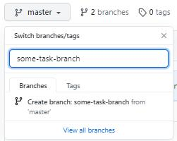

# Help Develop
When contributing to this repository, please first discuss the change you wish to make via issue,
with the owners of this repository, before making a change. Each pull request must first be an issue.

## Pull Request Process
1. Fork the repository.
1. Create a branch in your fork that matches the name of the issue you're working on.
1. Add the new feature or fix.
1. Run the unit tests and ensure that none fail.
1. Submit a pull request from your forked branch back to the `dev` branch of the repository.
1. Include the updated documentation in the pull request.
1. The pull request will be reviewed, then merged into `dev` if all tests pass, the changes will be pushed to the `master` branch and a new versioned build will be made.

::: tip Note
  Any new features require an accompanying unit test for it to be approved.
:::

## Getting Setup
Fork the `BlenderTools` repository.


Create a branch in your fork with the name of the task/issue you are working on.



Clone your fork and checkout that branch:
```shell
git clone https://github.com/<your-username>/BlenderTools.git
cd epic-tool-send2ue
git checkout some-task-branch
```

## Testing your changes
While developing, you will want to be able to rapidly test your new changes. You can do this by running this script in
the Blender Script Editor.

::: tip Note
  You need to change `<your-repo-location>` to match the absolute path to the scripts folder in your local project.
Running this script installs and reloads the tool.
:::


```python
import bpy
import sys
sys.path.append(r'C:\<your-repo-location>\BlenderTools\scripts')
import dev_helpers

addons = ['send2ue', 'ue2rigify']

# installs the actual addons zips
#dev_helpers.reload_addon_zips(addons)

# reloads the code from your repo. A lot faster but doesn't load addon preferences
dev_helpers.reload_addon_source_code(addons)

# start blender and unreal rpc server for automated testing
#bpy.ops.send2ue.start_rpc_servers()
```

## Code Structure

This is how the addon code is structured. You will see this primary file and folder structure in each of the addons.


```txt
.
├── ...
├── send2ue             # The root folder for the plugin
│   ├── core            # This folder contains all the core logic of the tool.
│   ├── dependencies    # This folder contains dependencies that have been added into the tool.
│   ├── resources       # This folder contains templates, settings, and extensions.
│   ├── ui              # This folder contains all UI classes for the tool.
│   ├── __init__.py     # This contains the plugin and initialization and uninitialization calls for all operators, properties and events.
│   ├── constants.py    # This file holds hard coded values that the tool utilizes.
│   ├── properties.py   # This file contains the property data definition for the tool. All tool properties should live in here.
│   └── operators.py    # This file contains all operator class definitions. This serves as the entry point to all logic that lives in the core module.
└── ...
```
