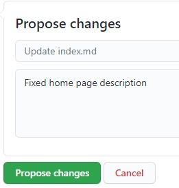

# Help Document
Having accurate and up to date documentation is important, so that is why we have made it easy to submit changes to our documentation. All the documentation pages are written in markdown, but html tags are supported.

## Editing a Page
To edit an existing page, click the link "Help us improve this page!" in the footer of the page you want to edit.


You will then be prompted to make your own fork of the repository. Click 'Fork this repository'.


Edit the markdown file and click 'Propose changes'.



Then create a pull request.


After your pull request is merged in a new deployment of the site will be made.

## Testing Locally
The documentation sites are static html sites that are generated using vuepress. To get up and running with vuepress.
packages are managed by `npm`. So first install the latest version of [node](https://nodejs.org/en/)
Once you have node and npm installed switch to the `/docs` folder and start the server for the site you want to preview by
running these commands:

``` shell
cd ./docs
npm install
npm run dev-main
```

The site should now be available to preview at:

[http://localhost:8080/](http://localhost:8080/)

There are multiple sites in the `docs` folder each site can be run like so:
* `npm run dev-main`
* `npm run dev-send2ue`
* `npm run dev-ue2rigify`

For further information on how to customize this site check out
the [vuepress documentation](https://vuepress.vuejs.org/)

# Building
All the sites get built on a linux machine into a single static html site when running:
```shell
npm run build
```

If successful, a `dist` folder should get generated in the `docs` folder. These files are what is deployed to the server.
You can serve them locally with:
```shell
python -m http.server --directory ./dist
```
