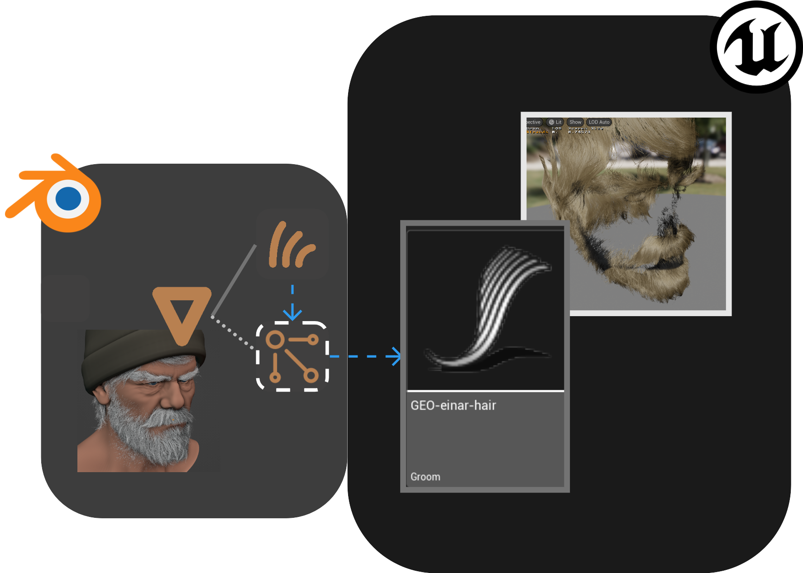

# Groom

::: warning Required UE Plugins
Make sure to have the unreal plugins "Alembic Groom Importer" and "Groom" enabled for the addon to work properly.

:::

::: warning Required UE Project Setting
Make sure to have the setting "Support Compute Skin Cache" turned on in Project Settings > Engine > Rendering > Optimizations for grooms to render properly when bound to a skeletal mesh.

:::

The tool infers an Unreal groom asset based strictly on the content of your `Export` collection. By default, each
particle system of type 'Hair' on each mesh in the collection is exported as an individual alembic file, which is
imported to unreal as a groom asset.

::: tip Combining Groom Assets
To gain more control over how particle systems are exported, use the [_combine assets_](/extensions/combine-assets.html)
extension that have options such as _combine groom for each mesh_ and more.
:::

::: warning
Please give each particle system and curves object a unique name across all meshes. While Blender lets particles on
different meshes share the same name, the addon requires each name to be unique to prevent assets getting overwritten
in Unreal. This is because multiple groom assets can be imported into the same directory in unreal, and any
asset with duplicate names will get overwritten.

:::

## Curves Objects

The Curves object type was introduced in [Blender 3.3](https://www.blender.org/download/releases/3-3/), enabling a revamped hair sculpting workflow. The send2ue addon
supports the export of a curves object into a groom asset in unreal. Under the hood, the addon temporarily converts
the curves object into a hair particle system on the mesh that it’s surfaced to, which would then be exported as an alembic file.

## Only Groom

By default, the groom asset will import along with the mesh asset that it is surfaced to. To run a strictly groom asset
import (meaning no other asset types will be exported from blender and imported to unreal), all import options (mesh,
animation, textures) must be turned off in your [import settings](/settings/import.html) except for `Groom`.

## Binding Assets and More

The addon provides an extension called [create post import assets for groom](/extensions/create-post-import-groom-assets.html)
to automatically create unreal assets (such as a binding asset) for the imported groom asset. See the extensions section
for more information on its usage.
