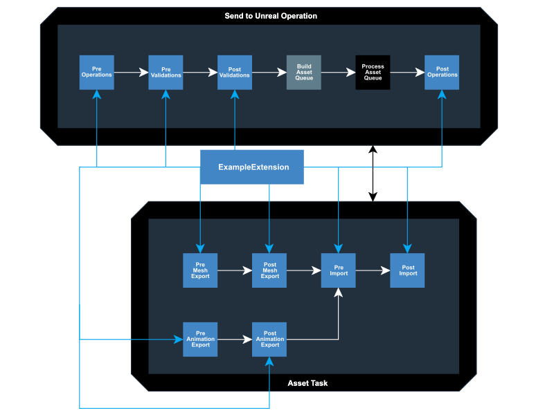
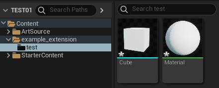
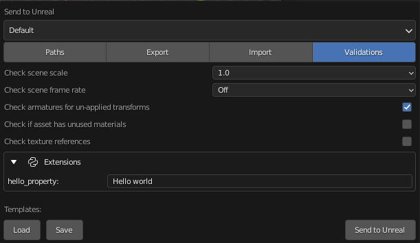

# Extensions

Extensions provide a python interface for Send to Unreal users to quickly and cleanly extend its functionality
with a minimal amount of code. Within an extension class several things can be defined:
* [Operators](/customize/extensions.html#operators)
* [Properties](/customize/extensions.html#properties)
* [Draws](/customize/extensions.html#draws)



In this diagram each blue arrow that plugs into a blue block represents how the extension factory takes
pieces of your extension class and plugs in its logic within the send to unreal operation.

::: tip Note
  The queue can run many asset tasks, therefore the extension logic added in the asset task area will be fired as many
times as there are assets. However, anything outside the asset task will be run once per send to unreal operation.
:::

## Example
Here is a simple example

### The Code
```python
import bpy
from send2ue.core.extension import ExtensionBase

class ExampleExtension(ExtensionBase):
    name = 'example'
    hello_property: bpy.props.StringProperty(default='Hello world')

    def draw_validations(self, dialog, layout):
        row = layout.row()
        row.prop(self.extensions.example, 'hello_property')

    def pre_operation(self):
        self.unreal_mesh_folder_path = '/Game/example_extension/test/'

    def pre_validations(self):
        if self.extensions.example.hello_property != 'Hello world':
            self.validations_passed = False

    def pre_mesh_export(self):
        print(self.file_path)
        print(self.asset_name)
```

This adds a property, a pre operation that changes the `unreal_mesh_folder_path` value, and a validation
that checks to ensure that `hello_property` is equal to "Hello world", otherwise it sets `self.validations_passed`
to false which terminates the send to unreal operation execution.

::: tip Note
  At minimum an extension must at least have the class attribute `name` defined, everything else is optional.
:::

### Installation
Save the extension code in a folder. This folder is know as the `Extensions Repo Folder`. You can place as many extensions
in this folder as needed. In this example, the file is saved to`C:\extension_repo\example.py`.


Then in the Send to Unreal addon preferences set the `Extensions Repo Folder` to `C:\extension_repo`. Then click the
`Reload Extensions` button.

::: tip Note
  Alternatively, this can be installed with python:
```python
# this is handy for reloading your changes as you develop extensions
bpy.context.preferences.addons['send2ue'].preferences.extensions_repo_path = 'C:\extension_repo'
bpy.ops.send2ue.reload_extensions()
bpy.ops.script.reload()
```
:::

### Test
Now when we use Send to Unreal to with the default cube, we can see the `file_path` and `asset_name` printing in the
console and that the cube got sent to the `/Game/example_extension/test/` folder in the unreal project.



This same approach can be applied to many other use cases where you need to extend the Send to Unreal operation.
For more examples check out the `/send2ue/resources/extensions` folder in the addon.

## Operators
Operators contain logic for key points within the runtime of the send to unreal
operation. This is done by name spacing operators within the `send2ue` operator namespace. At runtime, the operators within
each name space get executed. The methods below can be implemented in a extension class and the Send to Unreal
extension factory will inject the operations.

### pre_operation
Defines the pre operation logic that will be run before the send to unreal operation.
- param `Send2UeSceneProperties` `self` The send2ue scene properties.
```python
pre_operation(self: Send2UeSceneProperties)
```

### post_operation
Defines the post operation logic that will be run before the send to unreal operation.
- param `Send2UeSceneProperties` `self` The send2ue scene properties.
```python
post_operation(self: Send2UeSceneProperties)
```

### pre_validations
Defines the pre validation logic that will be an injected operation.
- param `Send2UeSceneProperties` `self` The send2ue scene properties.
```python
pre_validations(self: Send2UeSceneProperties)
```

### post_validations
Defines the post validation logic that will be an injected operation.
- param `Send2UeSceneProperties` `self` The send2ue scene properties.
```python
post_validations(self: Send2UeSceneProperties)
```

### pre_animation_export
Defines the pre animation export logic that will be an injected operation.
- param `Send2UeSceneProperties` `self` The send2ue scene properties.
```python
pre_animation_export(self: Send2UeSceneProperties)
```

### post_animation_export
Defines the post animation export logic that will be an injected operation.
- param `Send2UeSceneProperties` `self` The send2ue scene properties.
```python
post_animation_export(self: Send2UeSceneProperties)
```

### pre_mesh_export
Defines the pre mesh export logic that will be an injected operation.
- param `Send2UeSceneProperties` `self` The send2ue scene properties.
```python
pre_mesh_export(self: Send2UeSceneProperties)
```

### post_mesh_export
Defines the post mesh export logic that will be an injected operation.
- param `Send2UeSceneProperties` `self` The send2ue scene properties.
```python
post_mesh_export(self: Send2UeSceneProperties)
```

### pre_import
Defines the pre import logic that will be an injected operation.
- param `Send2UeSceneProperties` `self` The send2ue scene properties.
```python
pre_import(self: Send2UeSceneProperties)
```

### post_import
Defines the post import logic that will be an injected operation.
- param `Send2UeSceneProperties` `self` The send2ue scene properties.
```python
post_import(self: Send2UeSceneProperties)
```

### Utility Operators
Utility operators are authored just like you would author any other blender operator. The class attribute
`utility_operators` is a place where a list of operator classes can be assigned. This list of operator classes will be
auto registered and added to the utilities submenu under `Pipeline > Utilities`
```python
class ExtensionBase:
    utility_operators = [
        YourOperatorClass
    ]
```

Refer to the [blender API docs](https://docs.blender.org/api/current/bpy.types.Operator.html) for more information.

## Properties
Extension properties must be defined in the extension class's annotations. This is done using the `:` instead of `=`
for assignment like so:
```python
class ExampleExtension(ExtensionBase):
    name = 'example'
    hello_property: bpy.props.StringProperty(default='Hello world')
```
::: tip Note
  Properties can be any property type in `bpy.props`
:::

All properties defined in the extension class get registered as a sub property group within the
`send2ue` scene data hierarchy. In the above example, the `hello_property` could be accessed within a
extension operator like:
```python
self.extensions.example.hello_property
```
Or globally like:
```python
bpy.context.scene.send2ue.extensions.example.hello_property
```

::: tip Note
  Extension properties get saved when the blend file is saved, and can have their values saved to templates
just like the default properties that exist in the Send to Unreal tool.
:::

## Draws
Defining draws for your extension is a way to make your extension properties available to be edited by the user.
Using the same example extension above, the `draw_validations` implementation adds this UI into the Send to
Unreal Settings Dialog.



### draw_validations
Can be overridden to draw an interface for the extension under the validations tab.
- param `Send2UeSceneProperties` `self` The send2ue scene properties.
- param `Send2UnrealDialog` `dialog` The dialog class.
- param `bpy.types.UILayout` `layout` The extension layout area.
```python
draw_validations(self: Send2UeSceneProperties, dialog: Send2UnrealDialog, bpy.types.UILayout: layout)
```

### draw_export
Can be overridden to draw an interface for the extension under the export tab.
- param `Send2UeSceneProperties` `self` The send2ue scene properties.
- param `Send2UnrealDialog` `dialog` The dialog class.
- param `bpy.types.UILayout` `layout` The extension layout area.
```python
draw_export(self: Send2UeSceneProperties, dialog: Send2UnrealDialog, bpy.types.UILayout: layout)
```

### draw_import
Can be overridden to draw an interface for the extension under the import tab.
- param `Send2UeSceneProperties` `self` The send2ue scene properties.
- param `Send2UnrealDialog` `dialog` The dialog class.
- param `bpy.types.UILayout` `layout` The extension layout area.
```python
draw_import(self: Send2UeSceneProperties, dialog: Send2UnrealDialog, bpy.types.UILayout: layout)
```


