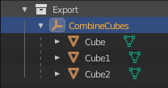

# Supported Extensions
These extensions ship with the Send to Unreal addon and are supported by this repository.

* [Affixes](https://epicgames.github.io/BlenderTools/send2ue/extras/supported-extensions.html#affixes)
* [UE to Rigify](https://epicgames.github.io/BlenderTools/send2ue/extras/supported-extensions.html#ue-to-rigify)
* [Object Origin](https://epicgames.github.io/BlenderTools/send2ue/extras/supported-extensions.html#object-origin)
* [Combine Meshes](https://epicgames.github.io/BlenderTools/send2ue/extras/supported-extensions.html#combine-meshes)
* [Use Immediate Parent Name](https://epicgames.github.io/BlenderTools/send2ue/extras/supported-extensions.html#use-immediate-parent-name)
* [Use Collections as Folders](https://epicgames.github.io/BlenderTools/send2ue/extras/supported-extensions.html#use-collections-as-folders)

## Affixes
The Affixes extension provides a convenient way to enforce prefix or postfix naming conventions on
assets of a particular type.  Currently, supported asset types are:
* `Static Mesh`
* `Skeletal Mesh`
* `Animation Sequence`
* `Material`
* `Texture`

### UI
The settings can be found under the `Export` tab

### Properties
#### Automatically add affixes on export
If true, this will automatically add the affixes (prefix/suffix) by renaming all assets that are currently in the
`Export` collection when the Send to Unreal operation runs.

#### Automatically remove affixes after export
If true, this will automatically remove the affixes (prefix/suffix) by renaming all assets that are currently in the
`Export` collection after the Send to Unreal operation runs.

::: tip Note
 This will rename the objects in Blender, like Meshes, Textures, Materials and Actions. Be aware that this will also rename the texture image files on your hard-disk.
:::

### Utility Operators
#### Add Asset Affixes
Adds the affixes (prefix/suffix) by renaming all assets that are currently in the `Export` collection.

#### Removes Asset Affixes
Removes the affixes (prefix/suffix) by renaming all assets that are currently in the `Export` collection.

## UE to Rigify
A small extension that runs a validation to ensure the user is not attempting to run the Send to Unreal operation
while the using the UE to Rigify tool in control mode.

## Object Origin
Lets the user use the object origin, or first frame on an action as the asset origin in unreal.

### Properties
#### Use object origin
When active, this option will center each object or action at world origin before it is exported,
then it will move each object back to its original position.

### UI
The settings can be found under the `Export` tab

## Combine Meshes
Lets the user combine child meshes.

#### Static Meshes
All child meshes under an empty will be combined into one static mesh using the name of the empty.

In this example the name of the combine static mesh in unreal would be `CombinedCubes`

#### Skeletal Meshes
All child meshes under an armature will be combined into one skeletal mesh using the name of the first child mesh.

::: tip Note
 This might not give you enough control over the skeletal mesh name, so using the immediate parent name option can be useful.
:::

In this example the name of the combine skeletal mesh in unreal would be `SK_Mannequin_Female`

### Properties
#### Combine child meshes
This combines all child meshes of an empty object or armature object into a single mesh when exported. Meshes that are directly under the export collection will be exported as they normally would, along with meshes parented under an empty type object or a collection which would be combined accordingly.

### UI
The settings can be found under the `Export` tab

## Use Immediate Parent Name
Gives the user more control over the naming of the assets sent to unreal with the asset taking on the name of its immediate parent that is either a collection or an empty type object.

#### Special Notes on Skeletal Meshes
A mesh under an armature will take the name of the immediate parent of the said armature if the immediate parent is an empty type object or a collection.

### Properties
#### use immediate parent name
When active, this makes the immediate parent the name of the asset if the immediate parent is a collection or an empty type object. This setting can be used concurrently with import LODs or combine meshes.

### UI
The settings can be found under the `Paths` tab

> Use Immediate Parent Name is an exclusive usage extension, which means that an error will be raised if it is used in combination with another exclusive usage extension.

## Use Collections as Folders
Let collections in blender persist through the send2ue operation as folders in unreal.

### Properties
#### use collections as folders
When active, this uses the collection hierarchy in your scene as sub folders from the specified mesh folder in your unreal project. This setting can be used concurrently with import LODs or combine meshes.

### UI
The settings can be found under the `Paths` tab

> Use Collections as Folders is an exclusive usage extension, which means that an error will be raised if it is used in combination with another exclusive usage extension.

