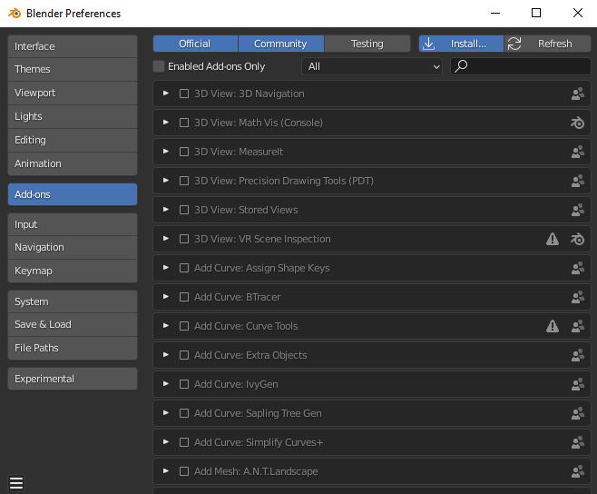
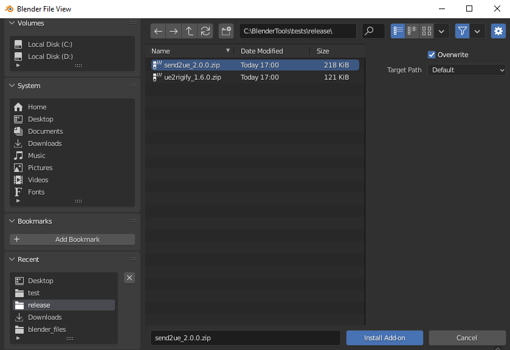
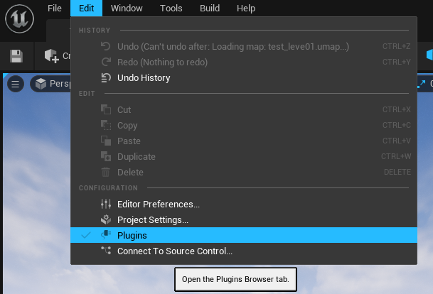
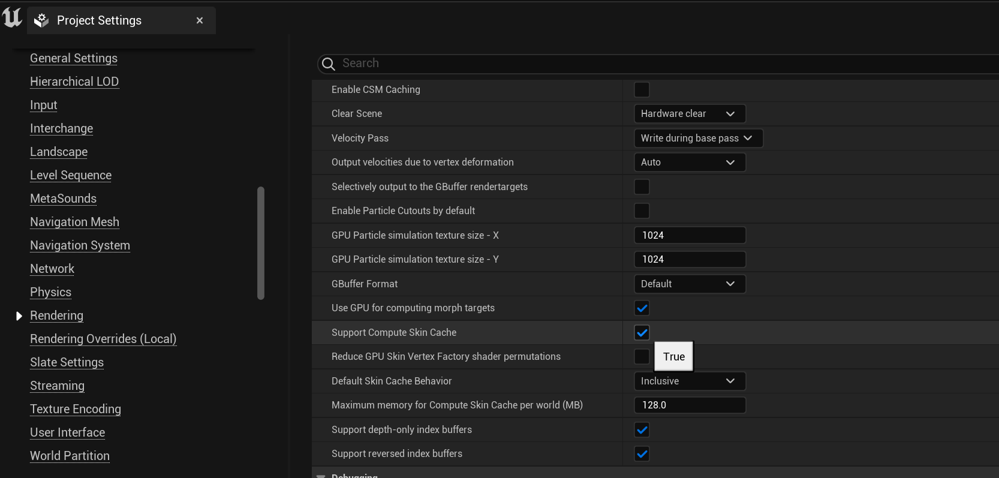
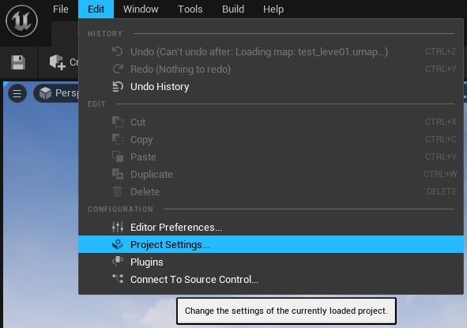
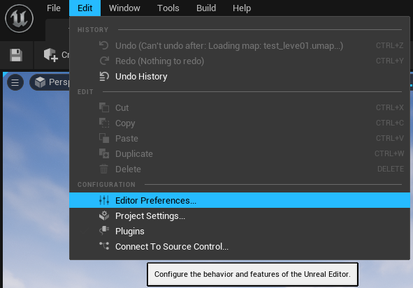
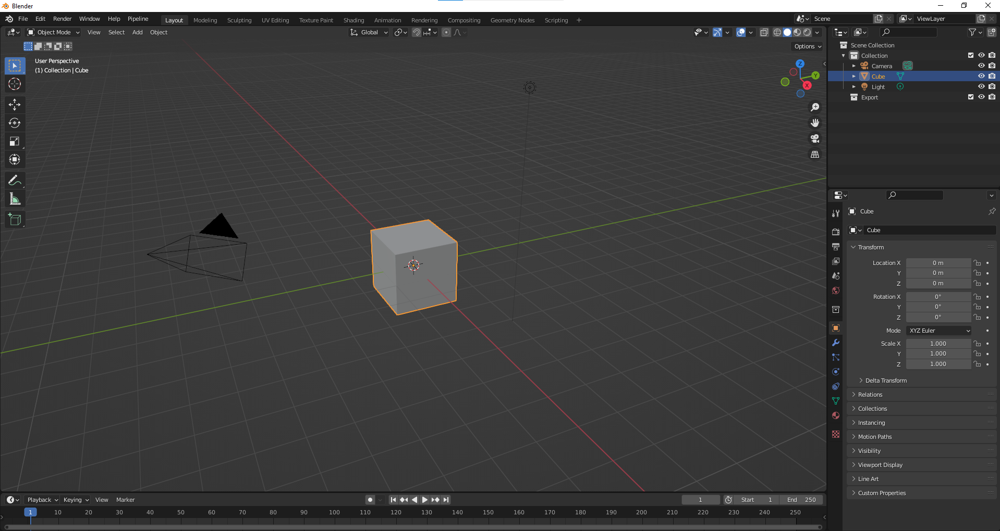
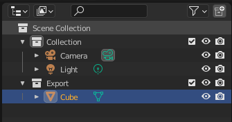
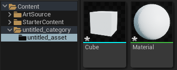

# Quickstart
This quick start guide will help you get up and running with Send to Unreal.

First thing you need to do is download the latest versioned zip file from the [releases page](https://github.com/EpicGamesExt/BlenderTools/releases?q=Send+to+unreal&expanded=true)
under the `Assets` dropdown. The zip file name will start with `send2ue`.

::: tip Note
   If you get a 404 error when you click the link above, then you will need to sign in to your github account and link
it with your Epic Games account. Here is a [link with instructions](https://www.unrealengine.com/en-US/ue4-on-github)
on how to link your accounts.
:::

Next install the addon in Blender. Go to `Edit > Preferences` then to the addons tab. Click `install`.

Go to the location where you downloaded your addon on disk and install the zip file.

Now search for the addon and activate it.

You'll notice when you activate it. This pipeline menu gets built.

Next, you'll need to configure your unreal project (or verify that your project settings are already correct).
So let's walk through an example with a new project. First, open Unreal and create a new project.
Once your project is open, go to `Edit > Plugins`.

Search for the "Python Editor Script Plugin" and enable it. Also ensure that the "Editor Scripting Utilities Plugin" is
already enabled.

If you are also working with groom assets and would like to export alembic files from blender as unreal groom assets,
make sure to also have the plugins "Alembic Groom Importer" and "Groom" enabled.

Additionally, make sure the "Support Compute Skin Cache" setting is turned on in Project Settings > Engine > Rendering > Optimizations.
This ensures grooms to render properly when bound to a skeletal mesh.

Once you have enabled the plugins and project settings, you'll be prompted to restart the editor. Go ahead and restart. Once you've restarted, go to `Edit > Project Settings`.

Search for "python" and then enable remote execution. Now Send to Unreal will work with your new Unreal project.

Another thing that is useful to enable under `Edit > Editor Preferences`

Search for "CPU", then under Editor Performance disable "Use Less CPU when in Background".
That way unreal continues to update even when it is not the active application, which means the Unreal user interface
will update constantly, and you will see your changes update without having to click on the Unreal Editor.

Now lets run through a basic example with the default cube in your Blender scene.

A simple test we can try in Blender to make sure this is working is move our cube to our `Export` collection.

Click `Pipeline > Export > Send to Unreal`.

::: tip Note
  On Windows, if you see a security alert, go ahead and allow Blender on your private network.
:::

You should now see the cube in unreal under `/untitled category/untitled asset/Cube`.

Congrats, Send to Unreal is now working! To customize Send to Unreal to your needs, go to
`Pipeline > Export > Settings Dialog`. Here you can customize the paths for exports and imports
as well as the export and import settings, and validations.

