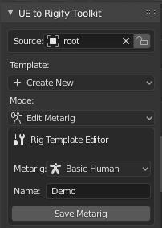
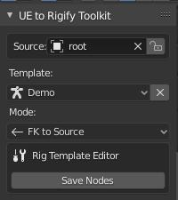

# UE to Rigify Panel
This section defines all the properties and operators depicted below in the ‘UE to Rigify’ panel in the 3D viewport.

### Source

This object picker specifies which object is the ‘Source’ rig.

### Template

This dropdown allows you to select a template or create a new one. New templates are stored within:
- windows: `%TEMP%\ue2rigify\resources\rig_templates`
- unix: `/tmp/ue2rigify/resources/rig_templates`

### Mode

This dropdown allows you to select which mode you want to edit your rig template in. The ‘UE to Rigify’ modes are: ‘Source’, ‘Edit Metarig’, ‘FK to Source’, ‘Source to Deform’, and ‘Control’.

### Overwrite Animation

If enabled, your control rig animation data will be overwritten by the animation data from your source rig.

### Metarig

This dropdown gives you some metarig presets that you can use as starting points when creating your new metarig template.

### Name

This property defines the name of your new rig template.

### Save Metarig

This operator saves the state of your current metarig into the rig template file, and switches the mode back to ‘Source’ mode.

### Save Nodes

This operator saves the state of your current node tree into the rig template file, and switches the mode back to ‘Source’ mode.

### Convert

This operator switches the current mode to ‘Control’ mode, builds the Rigify rig, and constrains the ‘Source’ rig bones to it.

### Revert

This operator switches the current mode to ‘Source’ mode, and restores the view to just the ‘Source’ rig.

### Bake

This operator bakes the ‘Control’ rig actions to the ‘Source’ rig actions.

### Freeze
This operator freezes the rig so the user doesn't lose their data by changing modes. If the .blend file is saved in control mode, UE to Rigify will automatically freeze the rig so the rig stays unmodified from when it was last saved.
Since mode changes are actually a complete deletion and creation of a new rigify rig, only the info provided by the "template" will be available after a mode change. So this is what freezing is for; it is a way to prevent doing a mode change. Mode changes can potentially be destructive. If you are adding information that is not through the rigify properties on the metarig, or through the node trees, then that data will be deleted on a mode change.
UE to Rigify is designed to quickly create and delete all the constraint hierarchy, rigify rigs, and their associated data while the user is flipping through modes and editing the custom template. However, once a final custom template is made, it is highly recommended that the user freeze the rig when animating in control mode.
